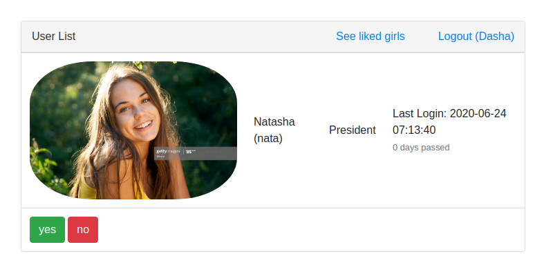

# Tinder Java assessment

The goal of the application is to demonstrate obtained skills on Java web.

## Goal
Create an application which replicate popular dating application Tinder.
Application must allow to:
- Login/Logout
- See user profiles
- Like/Dislike profiles
- See liked profiles
- Have messaging system between users

## Contributors
| [Max Belushkin](https://github.com/belushkin) |
| :---: | :---: |
|  |

- @belushkin

## Technologies used
- Java 8
- Postgres (AWS RDS)
- JDBC
- Freemarker
- Servlets
- AWS ElasticBeansTalk
- Tomcat
- Maven
- Junit4 + Mockito

## URL and credentials
- http://tinderapp-env-1.eba-ujzmyrmh.us-east-1.elasticbeanstalk.com/
- olga/olga
- dasha/dasha
- nata/nata

### How app does look like

## Additional technical information which had been used during development

### Tomcat server
- sudo systemctl start tomcat
- sudo systemctl status tomcat
- sudo systemctl daemon-reload
- sudo systemctl start tomcat
- sudo systemctl status tomcat

### Tail logs
- tail -f /opt/tomcat/logs/catalina.out

### Selected Maven deployment mechanism
- mvn cargo:deploy

### Database commands
- psql -h database-1.cl2n834aix67.us-east-1.rds.amazonaws.com -U postgres
- LhlyOD1JvL2XnLHO2xoE

- psql -h aa12ctchocsiwsm.cl2n834aix67.us-east-1.rds.amazonaws.com -U postgres
- LhlyOD1JvL2XnLHO2xoE

### PostgreSQL show tables using psql
\dt

### List databases
\l

### Connect to database
\c tinder

### Expanded view:
- \x
- select * from users;

### Dump and restore postgres database
- pg_dump -h database-1.cl2n834aix67.us-east-1.rds.amazonaws.com -U postgres tinder > dump.sql
- psql aa12ctchocsiwsm.cl2n834aix67.us-east-1.rds.amazonaws.com -U postgres tinder < dump.sql

